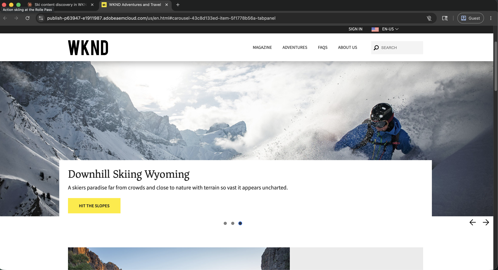

# Adobe CX Enterprise Agent-Tools

<!-- last-modified: 2026-06-08 -->

>[!VIDEO](https://video.tv.adobe.com/v/3491235/?learn=on&enablevpops)

Lassen Sie KI zu Ihrem Mitarbeiter für Adobe CX Enterprise werden. Verbinden Sie Ihren KI-Client mit Kampagnen, Audiences, Journey und Inhalten. Interagieren Sie mit ihnen in einfacher Sprache aus jedem Tool, das Sie bereits verwenden. Keine neuen Schnittstellen, kein Kontextwechsel, keine Codierung erforderlich, um zu beginnen.

>[!TIP]
>**Erste Schritte mit CX Enterprise MCP.** Eine Verbindung gewährt Ihrem KI-Client Zugriff auf Adobe Journey Optimizer, Customer Journey Analytics und Real-Time CDP, basierend auf den Lizenzen Ihres Unternehmens. [Jetzt verbinden](tools/mcp-servers.md#cx-enterprise-mcp-servers)

<!--
CARDS

* tools/mcp-servers.md
  {title = MCP Servers}
  {description = Connect any MCP-compatible AI client to Adobe CX Enterprise workflows. Query data, analyze campaigns, and access audiences without leaving your AI tool.}
  {cta = Explore MCP Servers}
  {image = assets/mcp-servers-card.png}

* tools/agent-skills.md
  {title = Agent Skills}
  {description = Adobe-curated workflows that guide agents through CX Enterprise tasks. Domain expertise encoded once, applied consistently.}
  {cta = Explore Agent Skills}
  {image = assets/agent-skills-card.png}

* tools/apis.md
  {title = APIs for Builders}
  {description = Build custom Adobe CX Enterprise applications using agentic coding tools like Claude Code and Cursor.}
  {cta = Explore APIs for Builders}
  {image = assets/apis-card.png}
-->
<!-- START CARDS HTML - DO NOT MODIFY BY HAND -->

    

        

            

                <figure class="image x-is-16by9">
                    
                </figure>
            

            

                

                    

                        <a href="tools/mcp-servers.md" title="MCP-Server">MCP-Server</a>
                    

                    
Verbinden eines beliebigen MCP-kompatiblen KI-Clients mit Adobe CX Enterprise-Workflows. Abfragen von Daten, Analysieren von Kampagnen und Zugreifen auf Audiences, ohne das KI-Tool verlassen zu müssen.

                

                <a href="tools/mcp-servers.md" class="spectrum-Button spectrum-Button--outline spectrum-Button--primary spectrum-Button--sizeM" style="align-self: flex-start; margin-top: 1rem;">
                    Erkunden von MCP-Servern
                </a>
            

        

    

    

        

            

                <figure class="image x-is-16by9">
                    
                </figure>
            

            

                

                    

                        <a href="tools/agent-skills.md" title="Agent-Kenntnisse">Agentenfertigkeiten</a>
                    

                    
Von Adobe kuratierte Workflows, die Agenten durch CX Enterprise-Aufgaben führen. Einmal kodierte Domain-Expertise, konsistent angewendet.

                

                <a href="tools/agent-skills.md" class="spectrum-Button spectrum-Button--outline spectrum-Button--primary spectrum-Button--sizeM" style="align-self: flex-start; margin-top: 1rem;">
                    Erkunden von Agentenkenntnissen
                </a>
            

        

    

    

        

            

                <figure class="image x-is-16by9">
                    
                </figure>
            

            

                

                    

                        <a href="tools/apis.md" title="APIs für Builder">APIs für Builder</a>
                    

                    
Erstellen Sie benutzerdefinierte Adobe CX Enterprise-Anwendungen mit agenten Kodierungstools wie Claude Code und Cursor.

                

                <a href="tools/apis.md" class="spectrum-Button spectrum-Button--outline spectrum-Button--primary spectrum-Button--sizeM" style="align-self: flex-start; margin-top: 1rem;">
                    Erkunden von APIs für Builder
                </a>
            

        

    

<!-- END CARDS HTML - DO NOT MODIFY BY HAND -->

## Agent-Tools für jedes Team

>[!BEGINTABS]

>[!TAB MCP-Server]

Verwenden Sie einen beliebigen kompatiblen KI-Client, um in einfacher Sprache auf CX Enterprise-Anwendungen zuzugreifen. Keine Codierung erforderlich. Beginnen Sie mit CX Enterprise MCP für eine einzige Verbindung zu AJO, CJA und Real-Time CDP oder stellen Sie eine direkte Verbindung zu AEM und anderen Anwendungen her.

- Verbindung in Minuten von Claude, Cursor, ChatGPT und anderen MCP-kompatiblen Clients
- Abfragen von Kampagnen, Audiences und Journey von Daten in natürlicher Sprache
- Keine neuen Schnittstellen oder Schulungen erforderlich

[Erste Schritte mit MCP-Servern](tools/mcp-servers.md)

>[!TAB Agentenfertigkeiten]

Agent Skills kodiert Adobe Domain-Fachwissen als Anweisungen, die Ihr KI-Client befolgen kann. Anstatt zu improvisieren, weiß der Agent genau, was zu tun ist, zuverlässig, wiederholt und mit den Best Practices von Adobe abgestimmt.

- Konsistente Ergebnisse für wiederholbare CX Enterprise-Workflows
- Keine Notwendigkeit, dem Agenten Adobe zu erklären: Die Fertigkeit übernimmt das.
- Funktioniert bei allen KI-Clients, die Agentenfähigkeiten unterstützen

[Agent-Kenntnisse entdecken](tools/agent-skills.md)

>[!TAB APIs für Builder]

Direkter, programmgesteuerter Zugriff auf dieselben APIs, auf denen Adobe-Produkte basieren. Erstellen Sie benutzerdefinierte Programme und Integrationen, die Ihrem Team fokussierten, gesteuerten Zugriff auf bestimmte CX Enterprise-Workflows bieten.

- Einmalige Erstellung und Bereitstellung in der gesamten Organisation
- Fügen Sie Leitplanken, Genehmigungen und benutzerdefinierte Logik hinzu, die Ihr Team benötigt
- Verwenden Sie Claude-Code, Cursor und andere Tools für die Agentencodierung, um schneller zu erstellen

[Erkunden von APIs für Builder](tools/apis.md)

>[!ENDTABS]

## Agent-Instrumente in Aktion

Erfahren Sie, wie Adobe CX Enterprise Agent Tools in der Praxis aussehen. Jede exemplarische Vorgehensweise behandelt ein reales Geschäftsszenario vom Setup bis zum Ergebnis und zeigt genau auf, wie ein KI-Client verbunden wird, was gefragt werden soll und was zurückgegeben wird.

<!--
CARDS

* use-cases/analyze-campaign-performance.md
  {title = Analyze campaign performance}
  {description = Surface Customer Journey Analytics comparisons and conversion trends through plain-language questions. Uses CX Enterprise MCP.}
  {cta = Start walkthrough}

* use-cases/manage-aem-content.md
  {title = Manage AEM content with AI}
  {description = Discover, update, and publish pages and content fragments in AEM using natural language.}
  {cta = Start walkthrough}

-->
<!-- START CARDS HTML - DO NOT MODIFY BY HAND -->

    

        

            

                <figure class="image x-is-16by9">
                    
                </figure>
            

            

                

                    

                        <a href="use-cases/analyze-campaign-performance.md" title="Analysieren der Kampagnenleistung">Analysieren der Kampagnenleistung</a>
                    

                    
Ermitteln Sie Customer Journey Analytics-Vergleiche und Konversionstrends durch verständliche Fragen. Verwendet CX Enterprise MCP.

                

                <a href="use-cases/analyze-campaign-performance.md" class="spectrum-Button spectrum-Button--outline spectrum-Button--primary spectrum-Button--sizeM" style="align-self: flex-start; margin-top: 1rem;">
                    Anleitung starten
                </a>
            

        

    

    

        

            

                <figure class="image x-is-16by9">
                    
                </figure>
            

            

                

                    

                        <a href="use-cases/manage-aem-content.md" title="AEM-Inhalte mit KI verwalten">Verwalten von AEM-Inhalten mit KI</a>
                    

                    
Entdecken, aktualisieren und veröffentlichen Sie Seiten und Inhaltsfragmente in AEM in natürlicher Sprache.

                

                <a href="use-cases/manage-aem-content.md" class="spectrum-Button spectrum-Button--outline spectrum-Button--primary spectrum-Button--sizeM" style="align-self: flex-start; margin-top: 1rem;">
                    Anleitung starten
                </a>
            

        

    

<!-- END CARDS HTML - DO NOT MODIFY BY HAND -->

**[Alle exemplarischen Vorgehensweisen anzeigen](use-cases/overview.md)**

## Adobe-Ressourcen

| Ressource | Was Sie finden werden |
| --- | --- |
| [Adobe AI-Registrierung](https://developer.adobe.com/ai-registry/?type=mcp) | Vollständiger Katalog der MCP-Server |
| [Adobe Agent-Kenntnisse](https://github.com/adobe/skills) | Von Adobe kuratierte Agentenkenntnisse für CX Enterprise-Workflows |
| [Adobe API-Katalog](https://developer.adobe.com/apis) | Vollständige Adobe CX Enterprise API-Referenz |
| [Adobe Developer Console](https://developer.adobe.com/developer-console/docs/guides/) | Einrichten und Authentifizieren von API-Projekten |
| [Adobe Admin Console](https://adminconsole.adobe.com) | Verwaltung des Benutzer- und Produktzugriffs |
| [Experience League](https://experienceleague.adobe.com/en/docs/experience-cloud-ai/experience-cloud-ai/home) | Vollständige Dokumentation und Tutorials zu Adobe-Programmen |
