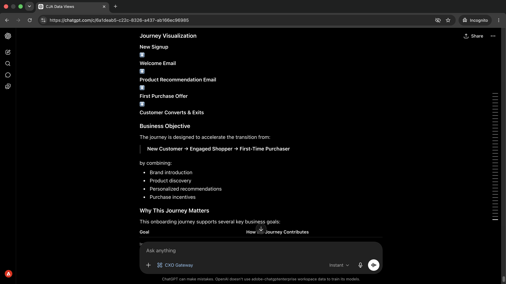

# Journey-Probleme erkennen, bevor sie Kunden betreffen
<!-- last-modified: 2026-06-08 -->


Um sich ein klares Bild davon zu machen, welche Journey aktiv sind, welche Bedingungen sie antreiben und wie Kampagnen normal konfiguriert sind, müssen Sie Adobe Journey Optimizer öffnen und in seiner Benutzeroberfläche navigieren. In dieser exemplarischen Vorgehensweise wird gezeigt, wie Sie dieselbe Sichtbarkeit über einen KI-Client erhalten, indem Sie das CX Enterprise MCP-Gateway verwenden, um AJO-Journey- und -Kampagnendaten mit verständlichen Fragen abzufragen.

| | |
| --- | --- |
| CX Enterprise-Anwendungen | Adobe Journey Optimizer (AJO) |
| Agent-Tools | CX Enterprise MCP-Gateway |
| Zielgruppe | Kampagnen-Manager, Marketing-Experten |
| Voraussetzung | MCP-kompatibler KI-Client, Zugriff auf AJO |

Jeder Schritt zeigt eine repräsentative Eingabeaufforderung und eine Beispiel-KI-Antwort. Ein **Mehr können Sie erreichen** Abschnitt folgt für weitere Untersuchungen in derselben Sitzung.


## Voraussetzungen

>[!BEGINTABS]

>[!TAB Claude.ai]

Verbinden Sie das CX Enterprise MCP-Gateway als benutzerdefinierten Connector, um auf Adobe Journey Optimizer-Tools zuzugreifen.

1. Gehen Sie **Claude.ai zu Einstellungen** Integrationen.
2. Wählen Sie **Benutzerdefinierten Connector hinzufügen** und geben Sie die Server-URL ein: `https://cx-enterprise.adobe.io/mcp`
3. Wählen Sie **Verbinden** aus und melden Sie sich mit Ihrer Adobe ID an.

Vollständiges Setup: [Claude.ai Custom Connectors-Dokumentation](https://support.claude.com/en/articles/11175166-get-started-with-custom-connectors-using-remote-mcp)

>[!TAB ChatGPT]

Verbinden Sie das CX Enterprise MCP Gateway mithilfe des ChatGPT Developer Mode (Pro-, Plus-, Business-, Enterprise- oder Education-Plan erforderlich).

1. Aktivieren Sie **Entwicklermodus** in **ChatGPT-Einstellungen**.
2. Navigieren Sie zu **Einstellungen > Integrationen** und wählen Sie **Benutzerdefinierten Connector hinzufügen > Remote-MCP-Server**.
3. Server-URL eingeben: `https://cx-enterprise.adobe.io/mcp`
4. Wählen Sie **Verbinden** aus und melden Sie sich mit Ihrer Adobe ID an.

Vollständiges Setup: [ChatGPT MCP-Dokumentation](https://developers.openai.com/api/docs/guides/tools-connectors-mcp)

>[!TAB Andere KI-Clients]

Verwenden Sie Gemini, Microsoft Copilot, Cursor, Claude Code oder eine andere MCP-kompatible Umgebung? Stellen Sie mithilfe dieses Endpunkts eine Verbindung zum CX Enterprise MCP Gateway her:

```
https://cx-enterprise.adobe.io/mcp
```

Vollständige Setup-Anweisungen für alle unterstützten Clients: [Verbinden mit Ihrem KI-Client](../tools/mcp-servers.md)

>[!ENDTABS]

>[!NOTE]
>
>Melden Sie sich bei Aufforderung mit Ihrer Adobe ID an und wählen Sie die mit Ihrer AJO-Umgebung verknüpfte IMS-Organisation aus. Die Wahl der falschen Organisation ist die häufigste Ursache für Authentifizierungsfehler.
>
>Bei der ersten Verbindung kann Ihr KI-Client Sie auffordern, eine IMS-Organisation auszuwählen oder eine Sandbox anzugeben. Sobald dieser Kontext festgelegt ist, verwendet ihn der MCP-Server für den Rest der Sitzung.
>
>Einige Tools fordern Sie vor der Ausführung zur Genehmigung auf. Überprüfen Sie die Anfrage und genehmigen oder ablehnen Sie - es wird keine Aktion ohne Ihre Bestätigung durchgeführt.


## Schritt 1: Entdecken Sie die aktiven Journey und ihren Zweck

Fragen Sie zunächst nach einer Übersicht über die aktiven Journey und die Unternehmensziele, die hinter ihnen stehen. Dies gibt Ihnen das vollständige Bild, bevor Sie in eine bestimmte Journey eintauchen.

```
What customer journeys are currently available and what business objectives do they support?
```

+++Siehe eine Beispielantwort


+++


## Schritt 2: Überprüfen Sie die Schritte einer Journey und das Kundenerlebnis.

Bitten Sie angesichts der angezeigten Journey-Liste Ihren KI-Client, eine bestimmte Journey zu durchlaufen und zu erklären, was der Kunde in jeder Phase erlebt.

```
Walk me through the [journey name] journey and explain the customer experience.
```

+++Siehe eine Beispielantwort



+++


>[!NOTE]
>
>Ersetzen Sie `[journey name]` durch den Namen einer Journey aus Ihren Ergebnissen von Schritt 1.


## Schritt 3: Überprüfen von Kampagnen, Audiences und Zielen

Wechseln Sie von Journey zu Kampagnen. Fragen Sie nach einer Zusammenfassung darüber, welche Kampagnen aktiv sind, auf wen sie abzielen und welche Ergebnisse sie fördern sollen.

```
Show me our campaigns, the audiences they target, and the outcomes they're designed to drive.
```

+++Siehe eine Beispielantwort


+++


## Schritt 4: Kampagnen und Journey verbinden

Bitten Sie Ihren KI-Client, die Punkte zwischen Kampagnen und Journeys zu verbinden und zu erklären, wie sie gemeinsam auf die Erreichung gemeinsamer Interaktionsziele hinarbeiten.

```
How do our campaigns and journeys work together to improve customer engagement?
```

+++Siehe eine Beispielantwort


+++


## Schritt 5: Abrufen priorisierter Empfehlungen

Fordern Sie nach priorisierten Empfehlungen, worauf Sie sich als Nächstes konzentrieren sollten, gerahmt aus der Perspektive eines Lebenszyklus-Marketing-Managers. Dadurch werden die wirkungsvollsten Lücken und Chancen von allem aufgezeigt, was in der Sitzung überprüft wurde.

```
If you were our lifecycle marketing manager, what would you prioritize next and why?
```

+++Siehe eine Beispielantwort


+++


>[!NOTE]
>
>Der AJO MCP-Server zeigt Journey- und Kampagneninformationen an, kann jedoch keine Journey, Kampagnen oder Inhalte ändern. Um Empfehlungen zu implementieren, gehen Sie direkt zur AJO-Anwendung oder verbinden Sie den AEM Content MCP-Server mit Inhaltsänderungen in derselben Sitzung.


## Was Sie erreicht haben

Sie haben einen KI-Client mit Adobe Journey Optimizer verbunden und durch fünf Aufforderungen ein vollständiges Bild Ihres Journey- und Kampagnenportfolios erstellt. Sie haben eine Inventarisierung der aktiven Journey und ihrer Geschäftsziele durchgeführt, die Kundenerfahrung für eine bestimmte Journey Schritt für Schritt geprüft, die aktiven Kampagnen ihren Zielgruppen und beabsichtigten Ergebnissen zugeordnet, verstanden, wie Kampagnen und Journey zusammenarbeiten, und priorisierte Empfehlungen dazu erhalten, worauf wir uns als Nächstes konzentrieren sollten. Dies bietet Lebenszyklus-Marketing- und Kampagnen-Managern strategische Sichtbarkeit, ohne die AJO-Benutzeroberfläche zu öffnen.


## Mehr können Sie erreichen

Das CX Enterprise MCP-Gateway kann eine Vielzahl von AJO-Journey- und Kampagnendetails aufdecken. Erweitern Sie ein unten stehendes Szenario, um Eingabeaufforderungen anzuzeigen, die Sie in derselben Sitzung versuchen können.

+++Erfahren Sie, was live ist, bevor Sie eine Änderung vornehmen

Änderungen an einer Journey vorzunehmen, ohne zu wissen, was sonst noch läuft, ist riskant. Über diese Eingabeaufforderungen erhalten Sie einen aktuellen Bestand an aktiven Elementen, kürzlich geänderten Elementen und der Konfiguration von Kampagnen.

**Eingabeaufforderungen**

```
Show me all journeys modified in the last 7 days.
```

```
Show me all journeys that use SMS as a channel.
```

```
Which campaigns are scheduled to end this week?
```

```
What loyalty challenges are currently active?
```

+++

+++Machen Sie sich mit den Einzelheiten einer bestimmten Journey vertraut

Wenn Sie eine Journey überprüfen, genehmigen oder übergeben müssen, sparen Sie Zeit, da Sie die vollständige Logik ohne Öffnen von AJO vor sich haben. Daraufhin werden bei Bedarf Oberflächenbedingungen, Bauteillisten und Segmentregeln angezeigt.

**Eingabeaufforderungen**

```
What is the entry condition for the [journey name] journey?
```

```
What are the exit conditions and timeout rules for the [journey name] journey?
```

```
What messages and wait conditions are in the [journey name] journey?
```

```
Which segment does the [journey name] journey target?
```

+++

+++Informieren Sie sich über die Details einer bestimmten Kampagne

Wenn Sie die vollständige Konfiguration einer Kampagne überprüfen müssen, bevor Sie sie genehmigen, übergeben oder Änderungen vornehmen, werden auf diese Weise Zielgruppenregeln, Kanaleinstellungen und Zeitplandetails angezeigt, ohne AJO zu öffnen.

**Eingabeaufforderungen**

```
Walk me through the full configuration of the [campaign name] campaign.
```

```
What audience does the [campaign name] campaign target and how large is that segment?
```

```
What frequency cap and send schedule apply to the [campaign name] campaign?
```

```
Are any campaigns targeting overlapping audiences?
```

```
What channel configurations are set up in our AJO environment?
```

+++


## Weitere Informationen

| Ressource | Was Sie finden werden |
| --- | --- |
| [AJO MCP-Server in der KI-Registrierung](https://developer.adobe.com/ai-registry/#/mcp/ajo-mcp-server) | AJO MCP Server-Tools und Verfügbarkeit |
| [Dokumentation zu AJO](https://experienceleague.adobe.com/de/docs/journey-optimizer/using/ajo-home) | Vollständige Dokumentation zu AJO-Programmen |
| [AJO-APIs](https://developer.adobe.com/journey-optimizer-apis/) | AJO-API-Referenz für benutzerdefinierte Integrationen |
| [AJO-Tutorials](https://experienceleague.adobe.com/de/docs/journey-optimizer-learn/tutorials/overview) | Video-Tutorials und Lernpläne |
