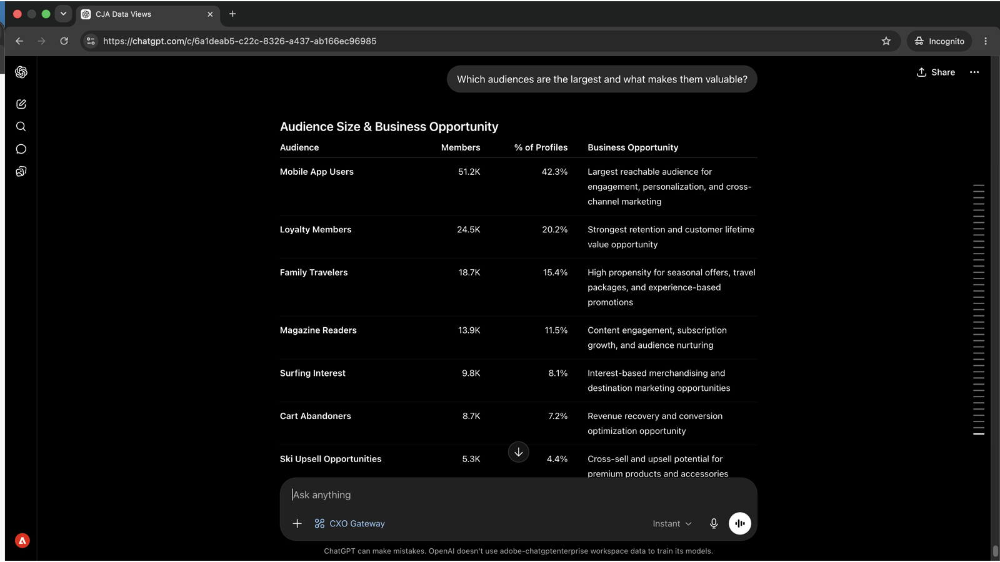

# Zielgruppen verstehen und wo sie aktiviert werden

<!-- last-modified: 2026-06-04 -->


Um zu verstehen, welche Zielgruppen aktiviert sind, wo sie fließen und ob Ziele in Ordnung sind, müssen Sie in der Regel Real-Time CDP öffnen und mehrere Bildschirme navigieren. In dieser exemplarischen Vorgehensweise wird gezeigt, wie Sie dieselben Antworten über einen KI-Client erhalten, indem Sie den RTCDP-MCP-Server verwenden, um die Zielkonfiguration, den Aktivierungsstatus und die Datenflussintegrität durch klar formulierte Fragen zu verdeutlichen.

| | |
| --- | --- |
| CX Enterprise-Anwendungen | Real-Time Customer Data Platform (Real-Time CDP) |
| Agent-Tools | CX Enterprise MCP-Gateway |
| Zielgruppe | Marketing-Experten, Analysten, Benutzer |
| Voraussetzung | MCP-kompatibler KI-Client, Zugriff auf Real-Time CDP |

Jeder Schritt zeigt eine repräsentative Eingabeaufforderung und eine Beispiel-KI-Antwort. Ein **Mehr können Sie erreichen** Abschnitt folgt für weitere Untersuchungen in derselben Sitzung.

## Voraussetzungen

>[!BEGINTABS]

>[!TAB Claude.ai]

Verbinden Sie das CX Enterprise MCP-Gateway als benutzerdefinierten Connector, um auf Real-Time CDP-Tools zuzugreifen.

1. Gehen Sie **Claude.ai zu Einstellungen** Integrationen.
2. Wählen Sie **Benutzerdefinierten Connector hinzufügen** und geben Sie die Server-URL ein: `https://cx-enterprise.adobe.io/mcp`
3. Wählen Sie **Verbinden** aus und melden Sie sich mit Ihrer Adobe ID an.

Vollständiges Setup: [Claude.ai Custom Connectors-Dokumentation](https://support.claude.com/en/articles/11175166-get-started-with-custom-connectors-using-remote-mcp)

>[!TAB ChatGPT]

Verbinden Sie das CX Enterprise MCP Gateway mithilfe des ChatGPT Developer Mode (Pro-, Plus-, Business-, Enterprise- oder Education-Plan erforderlich).

1. Aktivieren Sie **Entwicklermodus** in **ChatGPT-Einstellungen**.
2. Navigieren Sie zu **Einstellungen > Integrationen** und wählen Sie **Benutzerdefinierten Connector hinzufügen > Remote-MCP-Server**.
3. Server-URL eingeben: `https://cx-enterprise.adobe.io/mcp`
4. Wählen Sie **Verbinden** aus und melden Sie sich mit Ihrer Adobe ID an.

Vollständiges Setup: [ChatGPT MCP-Dokumentation](https://developers.openai.com/api/docs/guides/tools-connectors-mcp)

>[!TAB Andere KI-Clients]

Verwenden Sie Gemini, Microsoft Copilot, Cursor, Claude Code oder eine andere MCP-kompatible Umgebung? Stellen Sie mithilfe dieses Endpunkts eine Verbindung zum CX Enterprise MCP Gateway her:

```
https://cx-enterprise.adobe.io/mcp
```

Vollständige Setup-Anweisungen für alle unterstützten Clients: [Verbinden mit Ihrem KI-Client](../tools/mcp-servers.md)

>[!ENDTABS]

>[!NOTE]
>
>Melden Sie sich bei Aufforderung mit Ihrer Adobe ID an und wählen Sie die mit Ihrer Real-Time CDP-Instanz verknüpfte IMS-Organisation aus. Die Wahl der falschen Organisation ist die häufigste Ursache für Authentifizierungsfehler.

## Schritt 1: Entdecken Sie Ihre Audiences und ihre Bedeutung

Fragen Sie zunächst nach einer Aufstellung der verfügbaren Zielgruppen und der von ihnen erfassten Kundenverhaltensweisen. Dadurch erhalten Sie die vollständige Landschaft, bevor Sie in ein bestimmtes Segment bohren.

```
What audiences are currently available and what customer behaviors do they represent?
```

+++Siehe eine Beispielantwort


+++


## Schritt 2: Identifizieren Sie Ihre wertvollsten Segmente

Fragen Sie sich angesichts der Zielgruppenlandschaft, welche Segmente am größten sind und was sie strategisch wertvoll macht.

```
Which audiences are the largest and what makes them valuable?
```

+++Siehe eine Beispielantwort



+++


## Schritt 3: Überprüfen Sie Aktivierung und Ziele

Fragen Sie, wohin Ihre Zielgruppen derzeit fließen und für welche Ziele sie aktiviert sind.

```
Where are our audiences currently being activated and to which destinations?
```

+++Siehe eine Beispielantwort


+++


## Schritt 4: Abrufen strategischer Empfehlungen

Die RTCDP-Tools des CX Enterprise MCP-Gateways sind schreibgeschützt. Sie ermöglichen den Aktivierungsstatus, den Zielzustand und Datenflussdaten, ändern jedoch die Konfiguration nicht. Nachdem Sie ein Problem identifiziert haben, erfolgt die Fehlerbehebung in der Anwendung.

```
If you were our audience strategist, what would you prioritize next and why?
```

+++Siehe eine Beispielantwort


+++


>[!NOTE]
>
>Die Ziel- und Aktivierungsdaten der RTCDP-Tools des CX Enterprise MCP-Gateways können nicht geändert werden, jedoch nicht die Zielkonfiguration, Segmentdefinitionen oder Datenflusseinstellungen. In der Real-Time CDP-Anwendung werden Behebungsschritte ausgeführt.

## Was Sie erreicht haben

Sie haben einen KI-Client mit Real-Time CDP verbunden und an vier Eingabeaufforderungen ein strategisches Bild Ihres Zielgruppenportfolios erstellt. Sie haben die verfügbaren Zielgruppen den Kundenverhaltensweisen zugeordnet, die sie erfasst haben, Ihre größten und wertvollsten Segmente identifiziert, bestätigt, wo jede Zielgruppe hinfließt und zu welchen Zielen sie wechselt, und bei Ihrer nächsten Aktivierung priorisierte Empfehlungen erhalten. Dadurch wird die Navigation auf mehreren Real-Time CDP-Bildschirmen durch eine direkte, strategische Konversation ersetzt.

## Mehr können Sie erreichen

Die Real-Time CDP-Tools des CX Enterprise MCP-Gateways unterstützen eine Vielzahl von Zielgruppen- und Aktivierungsabfragen. Erweitern Sie ein unten stehendes Szenario, um Eingabeaufforderungen anzuzeigen, die Sie in derselben Sitzung versuchen können.

+++Vor dem Versand einer Kampagne genau wissen, was wo fließt

Aktivierungsfehler sind unauffällig. Zielgruppen können ohne Warnung nicht mehr weitergeleitet werden und senden Kampagnen an veraltete Listen. Diese Eingabeaufforderungen geben Ihnen ein klares Bild darüber, welche Segmente welche Ziele wann erreichen.

**Eingabeaufforderungen**

```
Which audiences are activated to Google Ads?
```

```
Show me the activation history for the [audience name] audience.
```

```
What is the last refresh time for the [audience name] audience?
```

+++

+++Aktivierungsprobleme erkennen, bevor sie eine Kampagne betreffen

Ein Ziel, das einen Lauf verpasst hat, oder ein Segment ohne aktives Ziel, bedeutet, dass Ihre Kampagne möglicherweise weniger Personen erreicht als beabsichtigt. Diese Eingabeaufforderungen decken diese Lücken proaktiv auf.

**Eingabeaufforderungen**

```
Are there any audiences with no active destinations?
```

```
Are any destination dataflows showing errors right now?
```

```
Which audiences have not been updated in the last 30 days?
```

+++

+++Auditieren und Verstehen der Zielgruppenlandschaft

Wenn sich die Zielgruppengröße ändert oder neue Segmente erstellt werden, hilft Ihnen ein klarer Bestand bei der Planung und Vermeidung der Aktivierung der falschen Liste. Diese Eingabeaufforderungen geben Ihnen diese Sichtbarkeit auf Anfrage.

**Eingabeaufforderungen**

```
How many profiles are in the [segment name] segment?
```

```
Show me all audiences created in the last 30 days.
```

```
Which audience has grown the most in the last 60 days?
```

```
How many total profiles are in my Real-Time CDP instance?
```

+++

+++Identitäten und Datenqualität verstehen

Identitäts-Namespaces und Zusammenführungsrichtlinien wirken sich direkt darauf aus, welche Profile in einer Zielgruppe enthalten sind und wie sie aufgelöst werden. Dies zeigt Details zur Oberflächenkonfiguration an, die unerwartete Zielgruppengrößen oder Profilüberschneidungen erklären können.

**Eingabeaufforderungen**

```
What identity namespaces are configured and which are most commonly used?
```

```
What merge policies are defined and which audiences use each one?
```

```
Are there any audiences using a non-default merge policy that could cause profile overlap?
```

+++


## Weitere Informationen

| Ressource | Was Sie finden werden |
| --- | --- |
| [Dokumentation zu Real-Time CDP MCP](https://experienceleague.adobe.com/en/docs/experience-cloud-ai/experience-cloud-ai/mcp/rtcdp-mcp) | MCP-Server-Setup und Tool-Referenz |
| [Adobe AI-Registrierung](https://developer.adobe.com/ai-registry/?type=mcp) | MCP-Server-Metadaten und -Verfügbarkeit |
| [Dokumentation zu Real-Time CDP](https://experienceleague.adobe.com/de/docs/experience-platform/rtcdp/home) | Vollständige Dokumentation zu Real-Time CDP-Programmen |
| Dokumentation zu [AEP-Zielen](https://experienceleague.adobe.com/de/docs/experience-platform/destinations/home) | Vollständige Zielreferenz |
